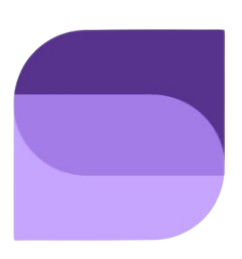

  

  # SYNCSNIP
  
  
  
  
  Transform Your Digital Presence

## ⚡ OVERVIEW

SyncSnip is your one-stop solution for web development, content writing, SEO management, and comprehensive IT solutions. We specialize in creating modern, responsive, and user-friendly digital experiences.

## 🎯 FEATURED WORKS

### 01 / E-Commerce Platform
- Full-stack solution with React & Node.js
- Secure payment integration
- Real-time inventory management

### 02 / SEO Optimization
- Improved search rankings by 200%
- Comprehensive analytics and reporting
- Integration with leading SEO tools

### 03 / Poddy Caster
- Feature-rich podcast streaming application
- Seamless integration with Spotify and YouTube APIs
- Offline listening and personalized recommendations

## 💫 Our Services

- *Web Development* 🌐: Crafting responsive and dynamic websites
- *App Development* 📱: Building seamless mobile applications
- *SEO Optimization* 🔍: Enhancing your online visibility
- *Content Strategy* ✍: Creating engaging and impactful content
- *UI/UX Design* 🎨: Designing intuitive and user-friendly interfaces
- *IT Consulting* 💼: Providing strategic IT solutions

## Tech Stack

- *Frontend*: React, Tailwind CSS
- *Backend*: Node.js, MongoDB
- *Mobile*: Flutter, Dart
- *Tools*: Google Analytics, SEMrush, Ahrefs
   

## Get in Touch

- *Website* 🌐: [syncsnip.netlify.app](http://syncsnip.netlify.app)
- *Email* 📧: syncsnip@outlook.com
- *Phone* 📞: [+91-9310708784](tel:+91-9310708784)

[Website](https://syncsnip.netlify.app/) • 
[GitHub](https://github.com/syncsnip) • 
[Email](mailto:syncsnip@outlook.com)

---
BUILT IN THE FUTURE // DELIVERED TODAY

  Built with ⤠by the SyncSnip Team

<!-- -------------------------------- -->
